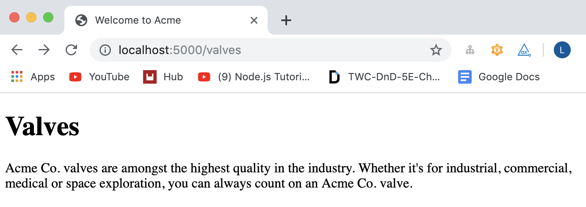

# README for Static Content Challenge

## Task
Create a node.js application that displays HTML pages at URLs that match the names of the folders in the `content` folder. The content of these pages should come from a combination of the template HTML file and a markdown file containing the content.

## Initial Thoughts
  - How does the web application framework express work, including routing?
  - Can I use the query string from the URL to make finding the correct markdown folder to get index.md out of easier/ more automated, to allow for easier expansion of app?
  - How do you combine a markdown file into a specific element of a html file?
  - How can you do the above dynamically and non-permanently depending on the url query string?
  - How do you do capybara-like feature tests on a node.js app - jest only offers snapshot testing - is there a better way?
  - How do you test HTTP status codes?

## Dependencies
  - **eslint** - checks for code quality and syntax errors
  - **mustache-express** - a templating system
  - **showdown** - converts markdown into html
  - **express** - web application's framework
  - **cypress** - testing

## The process: from altering the URL to rendering the page
1) user changes the url, this creates a get request which is read by express, if a get route has not been set up then the programme returns a 404 HTTP status code
2) the query string of the url(`req.route.path`) is used to identify which index.md file is needed )`reqDocPath`
3) the file is read using the filesystem module and the data is converted using showdown
4) mustache-express then renders the template.html and inserts the converted html into `{{{content}}}`

## Design Decision

### Altering template.html slightly
- I decided to alter template.html so that `{{content}}` became `{{{content}}}`
- I did this because this is how mustache-express knows not to escape the html element, I looked at alternatives so as not to change one of the original documents given to me but other ways seemed convoluted

### Not reducing the size of the controller
- I attempted to move out the logic into a module, or several modules which could then be unit tested, but I kept having problems with `fs.readFile()` and callbacks.
- I also looked into using one route to handle multiple url paths, with all the allowed paths stored in an array e.g. `app.get(["/valves", "/jobs", "/about-page"], function (req, res))`
- I understand that this leaves my code not DRY but with a little guidance I think I could fix this relatively easily

## Running the Code
- if you have not already, run `npm install` to install all the dependencies in the package.json file
- `$ node app.js`
- Then go to `http://localhost:5000` plus whatever specific page you want to see (`/about-page`, `/jobs`, `/valve`)

## Testing: using Cypress

### Tests written:
- [x] requests to valid URLs return a 200 HTTP status code
- [x] requests to valid URLS return a body that contains the HTML generated from the relevant `index.md` markdown file
- [x] requests to URLs that do not match content folders return a 404 HTTP status code

### How to run tests:
- if you have not already, run `npm install` to install all the dependencies in the package.json file, including cypress
- navigate into `static-content-challenge` and run`$ ./node_modules/.bin/cypress run`

### To look at individual test code:
- `cypress/integration` - all the feature tests
